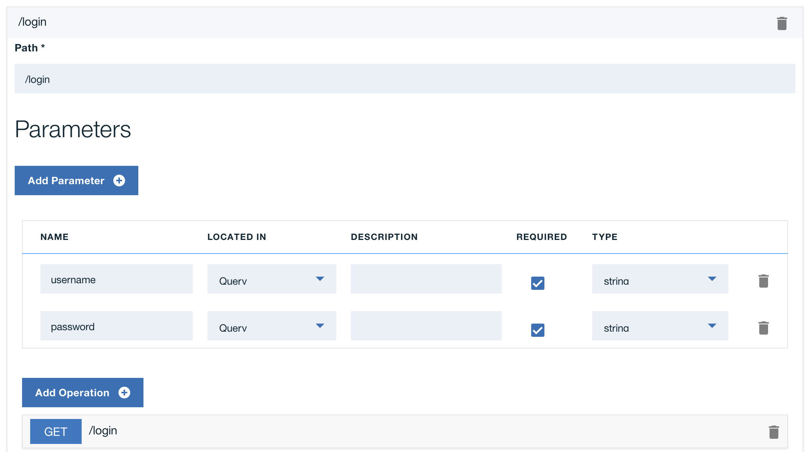

# Login implementation
This article addresses in detail how login is supported in the Case Inc Portal by using different practices for service encapsulation, Oauth, API authorization....

## Table of contents
* [Requirements to support](https://github.com/ibm-cloud-architecture/refarch-caseinc-app/blob/master/docs/login.md#requirements)
*

## Requirements
We want to support the following requirements:
* The portal application has a login page, then once authenticated the user is routed to a home page where he can access to a set of business function
* Userid and password are persisted in a LDAP server running on-premise
* The authentication is supported by adding an API (/login), on the API Connect server running on-premise
* The returned response from this authentication service is a Oauth access token that will be used as authorization Bearer token to any call to the back end services like the inventory API.
* A login page is used in the Angular 2 to get username and password.
* The BFF server exposes API for the user interface that needs to be accessible only if the user was previously authenticated

## API Definition on back end
A new url path is added to the API Connect inventory product to support login as illustrated below:
  

The logic to support this API has to do a call to the LDAP server and do some data transformation using XSLT to deliver a Oauth token:  
  

For the web application this URL is accessed via the IBM Secure Gateway running on Bluemix. The URL will be in the form of: https://cap-sg-prd-5.integration.ibmcloud.com:16582/csplab/sb/sample-inventory-api/login?username=<>&password=<>

The returned object is a Json object like below:
```Json
{
"token_type": "bearer",
"access_token": "AAEkNWuxlNl......",
"expires_in": 3600,
"scope": "scope1"
}
```
The access token is used as authorization attribute inside the HTTP header, we will detail that later.

Once the login mechanism is in place all other APIs defined in the `Inventory product` are secured: So the option `Use API security definitions` is checked for each API, like the `/items` one.
  

And the Security definition specifies what to use: oauth, X-IBM-Client-Id, and scope.
  


## BFF Server login proxy
We are using Passport.js to encapsulate the
The first component to add to the nodejs server for the web app is a userlogin.js which is using the `request` javascript module to perform the HTTP GET given the user, password. The following function is called when the user interface is access the RESTful URL `/login`, as defined in the server.js (`app.use('/login',userlogin)`).

```
router.get('/',function(req,res){
  ..
  request({
    method: 'GET',
    url: builtUrl,
    headers: {
      'X-IBM-Client-Id': config.apiGateway.xibmclientid,
      timeout:15000,
      'content-type': 'application/json',
      'User-Agent': 'request'
      }
  }, function (error, response, body) {

```
This code is under server/routes/features. The url base, the client id for API connect to put in the HTTP header, ... are in the env.json file.

The server code defines the mapping url to this new module:
```
app.use('/login',userlogin);
```


# Web Client Side
The login is supported by a specific Angular module with a route based on the url /log. In app.module.js the Login component declaration is added, with the route definition. The approach is to protect any route access if the user is not logged in. This is done by using the AuthGard component.

```javascript
import { LoginComponent }  from './login/login.component';
import { AuthGuard }       from './login/auth.guard';

 // ...
const routes: Routes = [
  { path: 'home', component: HomeComponent ,canActivate: [AuthGuard]},
  { path: 'log', component: LoginComponent },
  { path: 'inventory', component: InventoryComponent,canActivate: [AuthGuard]},
],
// ...
@NgModule({
    declarations: [
    LoginComponent],
    providers: [AuthGuard]
})
```  

The auth guard is used to prevent unauthenticated users from accessing restricted routes, it assess if the user is logged by using a localStorage:
```
```

### Login Component


## SSL Certificate
The communication between the nodejs web server, IBM secure gateway and then API Connect on premise is using SSL. As it is little bit complex we have create a separate note to explain what was performed to make this communication working. So see the detail [here](ssl.md)
